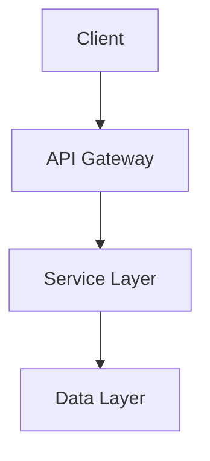

# Architecture Documentation

## project Architecture Overview

# Module: mod

## 1. Module Purpose and Responsibilities
The `mod` module, located at `./src/analyzer/mod.rs`, is a crucial part of the documentation generation tool. It is responsible for analyzing the codebase, extracting relevant information, and identifying gaps in the documentation. The module plays a key role in understanding the structure of the codebase and generating comprehensive documentation.

## 2. Key Functionality Provided
- Analyzing the codebase to extract information about modules, APIs, dependencies, and documentation coverage.
- Identifying gaps in the documentation and assessing their severity.
- Defining data structures to represent codebase elements such as modules, APIs, dependencies, and documentation items.

## 3. Main Data Structures and Types
The `mod` module defines several important data structures and types, including:
- `CodebaseAnalysis`: Represents the analysis results of the codebase.
- `Module`: Represents a module in the codebase.
- `ApiItem`: Represents an API item such as a function, struct, or trait.
- `ApiKind`: Enum defining the types of API items.
- `Dependency`: Represents a dependency of the codebase.
- `DependencyKind`: Enum defining the types of dependencies.
- `ExistingDoc`: Represents existing documentation items.
- `DocKind`: Enum defining the types of documentation items.
- `CoverageGap`: Represents a gap in documentation coverage and its severity.

## 4. Module's Role in the Overall Architecture
The `mod` module is a core component of the documentation generation tool, fitting into the layered architecture pattern of the codebase. It operates at a lower level, responsible for code analysis and data extraction, supporting the higher-level functionalities related to documentation generation and presentation. By providing insights into the codebase structure and documentation status, the module enables the tool to produce accurate and comprehensive documentation.

## 5. Dependencies and Interactions with Other Modules
The `mod` module interacts with various other modules and external dependencies to fulfill its responsibilities. It may depend on libraries like `anyhow`, `chrono`, `clap`, `colored`, `dirs`, `glob`, `governor`, `ignore`, `indicatif`, and `litellm-rs` for enhanced functionality. Additionally, it collaborates with modules handling documentation generation, presentation, and user interface to deliver a seamless documentation generation experience.

## 6. Usage Examples
```rust
use analyzer::mod::{CodebaseAnalysis, Module, ApiItem, ApiKind, Dependency, DependencyKind, ExistingDoc, DocKind, CoverageGap};

fn main() {
    // Perform codebase analysis
    let analysis = CodebaseAnalysis::analyze("./src");

    // Access modules and APIs
    for module in analysis.modules {
        println!("Module: {}", module.name);
        for api in module.apis {
            match api.kind {
                ApiKind::Function => println!("Function: {}", api.name),
                ApiKind::Struct => println!("Struct: {}", api.name),
                ApiKind::Trait => println!("Trait: {}", api.name),
            }
        }
    }

    // Check documentation coverage gaps
    for gap in analysis.coverage_gaps {
        match gap.severity {
            GapSeverity::Critical => println!("Critical gap: {}", gap.description),
            GapSeverity::Minor => println!("Minor gap: {}", gap.description),
        }
    }
}
```

This example demonstrates how to use the `mod` module to analyze a codebase, access modules and APIs, and identify documentation coverage gaps. By leveraging the functionalities provided by the module, developers can gain valuable insights into their codebase and improve documentation quality.


---

# Module: mod

## 1. Module Purpose and Responsibilities
The `mod` module, located at `./src/planner/mod.rs`, is responsible for query planning within the system. It handles the generation of query plans based on various criteria and constraints. The module aims to optimize query execution by determining the most efficient plan to retrieve the desired data.

## 2. Key Functionality Provided
- Creation of query plans
- Definition of query phases
- Specification of query context
- Setting query priorities
- Determination of query targets
- Estimation of query costs

## 3. Main Data Structures and Types
### Public Items:
1. `QueryPlan`: Represents a generated query plan.
2. `Phase`: Enum defining different phases of query execution.
3. `Query`: Struct representing a query to be planned.
4. `ContextSpec`: Struct specifying the context for query planning.
5. `QueryPriority`: Enum defining query priorities.
6. `QueryTarget`: Enum specifying the target of a query.
7. `EstimatedCost`: Struct representing the estimated cost of a query plan.
8. `create_query_plan`: Function to create a query plan.

## 4. Module Placement in the Overall Architecture
The `mod` module plays a crucial role in the system's layered architecture by residing in the planner component. It serves as the core component responsible for query planning, which is a critical part of the business logic layer. By separating query planning concerns into this module, the system maintains a clear distinction between planning functionality and other components, adhering to the layered architecture pattern.

## 5. Dependencies and Interactions with Other Modules
The `mod` module interacts with various other modules within the system to fulfill its responsibilities. It may depend on modules related to query parsing, data retrieval, and optimization strategies. Additionally, it might interact with modules handling query execution and result processing to ensure the successful execution of generated query plans.

## 6. Usage Examples
```rust
use planner::{Query, ContextSpec, create_query_plan};

fn main() {
    let query = Query::new("SELECT * FROM users");
    let context = ContextSpec::default();
    
    let query_plan = create_query_plan(&query, &context);
    
    match query_plan {
        Some(plan) => {
            println!("Query Plan: {:?}", plan);
        },
        None => {
            println!("Failed to generate query plan.");
        }
    }
}
```

In this example, a query is created, a context is specified, and a query plan is generated using the `create_query_plan` function from the `planner` module. The resulting query plan is then printed or handled accordingly based on the outcome of the planning process.


---

# Module: mod

## 1. Module Purpose and Responsibilities
The `mod` module, located at `./src/assembler/mod.rs`, is responsible for assembling and generating documentation. It plays a crucial role in the comprehensive documentation generation task of the project. This module handles the structuring and formatting of documentation content to produce well-organized and readable documentation output.

## 2. Key Functionality Provided
- **Documentation Structure**: Defines the structure of the documentation content.
- **Module Documentation**: Handles the documentation for different modules in the codebase.
- **API Documentation**: Manages the documentation for public APIs.
- **Example Documentation**: Deals with documenting code examples.
- **Document Assembler**: Assembles the documentation content.
- **Documentation Output**: Generates the final documentation output.

## 3. Main Data Structures and Types
The module defines several key data structures and types to facilitate the documentation assembly process. Some of the main ones include:
- `DocumentationStructure`: Represents the structure of the documentation content.
- `ModuleDoc`: Manages the documentation for modules.
- `ApiDoc`: Handles the documentation for APIs.
- `Example`: Represents code examples for documentation.
- `DocumentAssembler`: Assembles the documentation content.
- `DocumentationOutput`: Represents the final documentation output.

## 4. Module Integration into Overall Architecture
The `mod` module fits into the layered architecture pattern of the codebase by serving as a crucial component responsible for documentation generation. It interacts with other layers such as the business logic layer and presentation/UI layer to extract information about modules, APIs, and examples, and then structures and formats this information into comprehensive documentation.

## 5. Dependencies and Interactions with Other Modules
The `mod` module interacts with various other modules in the codebase to gather information for documentation generation. It may depend on modules related to parsing source code, extracting metadata, or formatting output. Additionally, it may utilize external dependencies such as `anyhow`, `chrono`, `clap`, `colored`, `dirs`, `glob`, `governor`, `ignore`, `indicatif`, and `litellm-rs` to enhance its functionality.

## 6. Usage Examples
```rust
use mod::{DocumentAssembler, assemble_documentation};

// Create a new DocumentAssembler instance
let mut doc_assembler = DocumentAssembler::new();

// Assemble documentation content
let documentation = assemble_documentation(&mut doc_assembler);

// Generate the final documentation output
let output = documentation.generate_output();

println!("{}", output);
```

This example demonstrates how to use the `mod` module to assemble and generate documentation output using the `DocumentAssembler` and `assemble_documentation` functions.


---

# `mod` Module Documentation

## 1. Module Purpose and Responsibilities
The `mod` module, located at `./src/generator/mod.rs`, is responsible for handling the generation of documentation. It contains functionalities related to parsing input, processing data, and generating documentation output. This module plays a crucial role in automating the documentation generation process efficiently and effectively.

## 2. Key Functionality Provided
- Parsing input queries and generating corresponding documentation.
- Handling the generation process to produce formatted documentation output.
- Managing interactions with other modules to gather necessary data for documentation generation.

## 3. Main Data Structures and Types
### Exported Items:
1. `QueryResult`: Represents the result of a parsed query.
2. `GenerationResult`: Represents the result of the documentation generation process.
3. `Generator`: Responsible for generating documentation based on input queries.
4. `execute_queries`: Function to execute queries and initiate the documentation generation process.

## 4. Module Integration in the Overall Architecture
The `mod` module aligns with the layered architecture pattern observed in the codebase. It serves as part of the business logic layer, focusing on the core functionality of generating documentation. By encapsulating documentation generation logic within this module, it promotes separation of concerns and maintainability in the codebase.

## 5. Dependencies and Interactions with Other Modules
The `mod` module interacts with various other modules to gather data, process queries, and format documentation output. It may depend on modules related to file handling, query parsing, and user interface interactions to fulfill its responsibilities effectively. Additionally, it may utilize external crates for enhanced functionality, as indicated by the project's dependency management.

## 6. Usage Examples
```rust
use generator::mod::{Generator, execute_queries};

// Define input queries
let queries = vec!["query1", "query2"];

// Initialize the Generator
let generator = Generator::new();

// Execute queries and generate documentation
let result = execute_queries(&generator, queries);

// Process the generation result
match result {
    GenerationResult::Success(doc) => {
        println!("Documentation generated successfully: {}", doc);
    },
    GenerationResult::Error(err) => {
        eprintln!("Error generating documentation: {}", err);
    },
}
```

In the example above, we demonstrate how to use the `Generator` and `execute_queries` function to generate documentation based on input queries. The result of the generation process is then handled to either display the generated documentation or handle any errors encountered during the process.


---

# Module: `mod`

## 1. Module Purpose and Responsibilities
The `mod` module, located at `./src/state/mod.rs`, is responsible for managing the state of the documentation generation process. It handles the generation state, loading and clearing of the state, and related functionalities to ensure the smooth operation of the documentation generation tool.

## 2. Key Functionality Provided
- **GenerationState**: Represents the state of the documentation generation process.
- **load_state**: Loads the state from a specified source.
- **clear_state**: Clears the current state, resetting it to a default state.

## 3. Main Data Structures and Types
- **GenerationState**: A struct representing the state of the documentation generation process. It likely contains fields to track the progress, configurations, and other relevant information.

## 4. Module's Role in the Overall Architecture
The `mod` module plays a crucial role in managing the state of the documentation generation process. It ensures that the tool maintains the necessary information and progress throughout the generation process. By encapsulating state-related functionalities, it promotes modularity and separation of concerns within the codebase.

## 5. Dependencies and Interactions with Other Modules
The `mod` module may interact with other modules to exchange state information or trigger actions based on the state changes. It might depend on utility modules for file operations, configuration modules for settings, or logging modules for reporting progress.

## 6. Usage Examples
```rust
use crate::state::{GenerationState, load_state, clear_state};

// Create a new GenerationState instance
let mut state = GenerationState::new();

// Load the state from a file
if let Some(loaded_state) = load_state("state.json") {
    state = loaded_state;
}

// Perform documentation generation tasks
// ...

// Clear the state after completion
clear_state(&mut state);
```

By utilizing the functionalities provided by the `mod` module, developers can effectively manage the state of the documentation generation process, ensuring consistency and reliability in the tool's operation.


---

# Parser Module Documentation

## Module: parser.rs

- **Module Purpose and Responsibilities:**
  The `parser` module in the Rust codebase is responsible for parsing code files to extract relevant information for documentation generation. It handles the analysis of code syntax and structure to generate structured data that can be used for documentation purposes.

- **Key Functionality Provided:**
  1. Parsing code files to extract metadata such as function names, parameters, return types, and comments.
  2. Generating a structured representation of the parsed code for further processing.
  3. Handling various programming language syntaxes and structures to ensure accurate parsing.

- **Main Data Structures and Types:**
  - `CodeParser`: A struct that encapsulates the functionality for parsing code files.
  - `ParsedFile`: A struct representing the parsed information extracted from a code file.

- **Module's Role in the Overall Architecture:**
  The `parser` module plays a crucial role in the layered architecture pattern of the codebase. It resides in the business logic layer, responsible for processing and analyzing code files to extract documentation-relevant information. The parsed data generated by this module serves as input for the documentation generation process in the presentation/UI layer.

- **Dependencies and Interactions with Other Modules:**
  The `parser` module interacts with other modules in the codebase to facilitate the documentation generation process. It may depend on utility modules for file handling, string manipulation, or language-specific parsing rules. The parsed data is typically passed to the presentation/UI layer for rendering documentation output.

- **Usage Examples:**
  ```rust
  use analyzer::parser::CodeParser;

  let code_parser = CodeParser::new();
  let parsed_data = code_parser.parse_file("example.rs");

  match parsed_data {
      Ok(parsed_file) => {
          println!("Parsed functions: {:?}", parsed_file.functions);
          println!("Parsed comments: {:?}", parsed_file.comments);
      },
      Err(e) => {
          eprintln!("Error parsing file: {}", e);
      }
  }
  ```

This documentation provides an overview of the `parser` module, its responsibilities, key functionality, data structures, integration into the architecture, dependencies, and usage examples. Developers can refer to this documentation to understand and utilize the parsing capabilities for documentation generation within the codebase effectively.


---

# Module: mod

## 1. Module Purpose and Responsibilities
The `mod` module, located at `./src/context/mod.rs`, is responsible for managing the context entries and context manager within the documentation generation tool. It handles the creation, storage, and retrieval of context information used during the documentation generation process.

## 2. Key Functionality Provided
- **ContextEntry**: Represents a single context entry containing key-value pairs of context information.
- **ContextManager**: Manages a collection of context entries and provides methods to add, retrieve, and manipulate context information.

## 3. Main Data Structures and Types
- **ContextEntry**: Struct that holds key-value pairs of context information.
- **ContextManager**: Struct that manages a collection of `ContextEntry` instances.

## 4. Module Integration in the Overall Architecture
The `mod` module plays a crucial role in the documentation generation tool by providing a centralized mechanism to store and manage context information. It fits into the layered architecture pattern by serving as part of the business logic layer responsible for handling context-related operations.

## 5. Dependencies and Interactions with Other Modules
The `mod` module interacts with other modules within the codebase to facilitate the documentation generation process. It may depend on utility modules for data manipulation and storage, as well as interact with modules responsible for parsing source files and generating documentation output.

## 6. Usage Examples
```rust
use crate::context::{ContextEntry, ContextManager};

// Create a new context entry
let entry = ContextEntry::new("key", "value");

// Create a context manager
let mut manager = ContextManager::new();

// Add context entry to the manager
manager.add_entry(entry);

// Retrieve context information
if let Some(value) = manager.get_value("key") {
    println!("Value: {}", value);
}
```

These examples demonstrate how to create a context entry, manage context information using a context manager, and retrieve specific context values within the `mod` module.

## System Diagrams



## Design Decisions

### Key Architectural Choices

- **Pattern**: Description of pattern used
- **Rationale**: Why this was chosen
- **Trade-offs**: What we gained and lost

