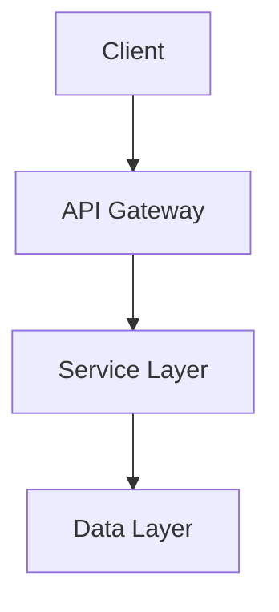

# Architecture Documentation

## project Architecture Overview

# Module: `mod`

## 1. Module Purpose and Responsibilities
The `mod` module, located at `./src/analyzer/mod.rs`, is a crucial component of the documentation generation tool in this Rust project. It is responsible for analyzing the codebase, extracting relevant information, and identifying documentation gaps. The module plays a key role in understanding the structure of the project, its dependencies, and the existing documentation coverage.

## 2. Key Functionality Provided
The `mod` module provides functionality for:
- Analyzing the codebase to extract information about modules, APIs, and dependencies.
- Identifying existing documentation and coverage gaps.
- Defining data structures for representing codebase elements and documentation-related entities.

## 3. Main Data Structures and Types
The module defines the following public data structures and types:
- `CodebaseAnalysis`: Represents the analysis results of the codebase.
- `Module`: Represents a module in the codebase.
- `ApiItem`: Represents an API item such as a function, struct, or trait.
- `ApiKind`: Enum defining different kinds of API items.
- `Dependency`: Represents a dependency of the codebase.
- `DependencyKind`: Enum defining different kinds of dependencies.
- `ExistingDoc`: Represents existing documentation for an API item.
- `DocKind`: Enum defining different kinds of documentation.
- `CoverageGap`: Represents a documentation coverage gap with severity levels.

## 4. Module's Role in the Overall Architecture
In the layered architecture of the project, the `mod` module resides in the business logic layer. It serves as a core component for codebase analysis and documentation assessment. By providing insights into the codebase structure and documentation status, it enables the generation of comprehensive and accurate documentation for the project.

## 5. Dependencies and Interactions with Other Modules
The `mod` module interacts with various other modules in the project to perform its tasks effectively. It may depend on modules related to file parsing, data extraction, and documentation generation. Additionally, it may utilize external crates for specific functionalities such as parsing code syntax or analyzing dependencies.

## 6. Usage Examples
```rust
use analyzer::mod::{CodebaseAnalysis, Module, ApiItem, ApiKind, Dependency, DependencyKind, ExistingDoc, DocKind, CoverageGap};

// Perform codebase analysis
let analysis = CodebaseAnalysis::analyze("./src");

// Access modules and APIs
for module in analysis.modules {
    println!("Module: {}", module.name);
    for api in module.apis {
        match api.kind {
            ApiKind::Function => println!("Function: {}", api.name),
            ApiKind::Struct => println!("Struct: {}", api.name),
            ApiKind::Trait => println!("Trait: {}", api.name),
            _ => println!("Other API: {}", api.name),
        }
    }
}

// Identify coverage gaps
for gap in analysis.coverage_gaps {
    match gap.severity {
        GapSeverity::Critical => println!("Critical gap: {}", gap.description),
        GapSeverity::Minor => println!("Minor gap: {}", gap.description),
        _ => println!("Gap: {}", gap.description),
    }
}
```

This example demonstrates how to use the `mod` module to analyze a codebase, access modules and APIs, and identify documentation coverage gaps. By leveraging the functionalities provided by this module, developers can gain insights into their project's documentation status and take necessary actions to improve it.


---

# Module: mod

## 1. Module Purpose and Responsibilities
The `mod` module, located at `./src/planner/mod.rs`, is responsible for handling query planning within the documentation generation tool. It focuses on creating query plans, managing query phases, defining query priorities, and estimating costs associated with queries.

## 2. Key Functionality Provided
- Creation of query plans
- Management of query phases
- Definition of query priorities
- Estimation of query costs

## 3. Main Data Structures and Types
### Public Items:
1. `QueryPlan`: Represents a query plan.
2. `Phase`: Enum defining different phases of a query.
3. `Query`: Struct representing a query.
4. `ContextSpec`: Struct defining the context specifications for a query.
5. `QueryPriority`: Enum specifying query priorities.
6. `QueryTarget`: Enum representing the target of a query.
7. `EstimatedCost`: Struct holding estimated costs for a query.
8. `create_query_plan`: Function to create a query plan.

## 4. Module Integration into Overall Architecture
The `mod` module plays a crucial role in the layered architecture of the documentation generation tool. It resides in the planner layer, responsible for query planning and execution. By encapsulating query-related functionalities, it promotes separation of concerns and maintainability within the application.

## 5. Dependencies and Interactions with Other Modules
The `mod` module interacts with various other modules within the codebase to fulfill its responsibilities. It may depend on modules related to query parsing, data retrieval, and result formatting. Additionally, it might utilize utility modules for cost estimation and priority assignment.

## 6. Usage Examples
```rust
use planner::{Query, QueryPriority, create_query_plan};

let query = Query {
    // Define query details
};

let query_priority = QueryPriority::High;

let query_plan = create_query_plan(query, query_priority);
```

These code snippets demonstrate how to create a query, specify its priority, and generate a query plan using the functionalities provided by the `mod` module.

This documentation provides an overview of the `mod` module, outlining its purpose, functionality, data structures, integration into the architecture, dependencies, and usage examples. Developers can refer to this information to understand and utilize the query planning capabilities offered by the module effectively.


---

# Module: mod

## 1. Module Purpose and Responsibilities
The `mod` module, located at `./src/assembler/mod.rs`, is responsible for assembling and generating documentation structures based on the provided input. It plays a crucial role in the documentation generation process by organizing and formatting the documentation content for output.

## 2. Key Functionality Provided
- **Documentation Structure**: Defines the structure of the documentation.
- **ModuleDoc**: Represents the documentation for a module.
- **ApiDoc**: Represents the documentation for an API.
- **Example**: Represents an example within the documentation.
- **DocumentAssembler**: Assembles the documentation based on the provided input.
- **assemble_documentation**: Function to trigger the documentation assembly process.
- **DocumentationOutput**: Represents the final output of the assembled documentation.

## 3. Main Data Structures and Types
- **DocumentationStructure**: Enum defining the structure of the documentation.
- **ModuleDoc**: Struct representing the documentation for a module.
- **ApiDoc**: Struct representing the documentation for an API.
- **Example**: Struct representing an example within the documentation.
- **DocumentationOutput**: Struct representing the final output of the assembled documentation.

## 4. Module's Place in the Overall Architecture
The `mod` module fits into the layered architecture of the project as part of the business logic layer. It handles the generation and structuring of documentation content, which is essential for the functionality of the documentation generation tool. By encapsulating the logic related to assembling documentation, it promotes separation of concerns and maintainability within the codebase.

## 5. Dependencies and Interactions with Other Modules
The `mod` module interacts with various other modules within the project to gather input data, process it, and generate the final documentation output. It may depend on modules related to parsing source code, extracting documentation comments, and formatting the output. Additionally, it may utilize utility modules for file handling, string manipulation, and other related tasks.

## 6. Usage Examples
```rust
use assembler::mod::{DocumentAssembler, assemble_documentation};

// Create a new DocumentAssembler instance
let mut doc_assembler = DocumentAssembler::new();

// Add module documentation
doc_assembler.add_module_documentation("Module A", "This is module A documentation.");

// Add API documentation
doc_assembler.add_api_documentation("Function A", "Description of Function A.");

// Add an example
doc_assembler.add_example("Example code snippet");

// Assemble the documentation
let documentation_output = assemble_documentation(&doc_assembler);

// Process the documentation output further
println!("{:?}", documentation_output);
```

This example demonstrates how to use the `DocumentAssembler` to create and assemble documentation content, including module documentation, API documentation, and examples. The `assemble_documentation` function is then used to generate the final documentation output, which can be further processed or displayed as needed.


---

# Module: mod

## 1. Module Purpose and Responsibilities
The `mod` module, located in `./src/generator/mod.rs`, is responsible for providing functionalities related to documentation generation within the Rust project. It encapsulates the core logic for generating documentation, handling queries, and executing the necessary operations to produce documentation output.

## 2. Key Functionality Provided
- **QueryResult**: Represents the result of a query execution.
- **GenerationResult**: Represents the result of the documentation generation process.
- **Generator**: Implements the logic for generating documentation based on queries.
- **execute_queries**: Function to execute queries for documentation generation.

## 3. Main Data Structures and Types
- **QueryResult**: Struct containing information about the result of a query execution.
- **GenerationResult**: Struct containing details about the result of the documentation generation process.
- **Generator**: Struct implementing the logic for generating documentation.
  
## 4. Module Integration in the Overall Architecture
The `mod` module aligns with the layered architecture pattern used in the project. It resides in the generator layer, responsible for handling the generation of documentation. By encapsulating the generation logic within this module, it promotes separation of concerns and maintains a clear structure where each layer has distinct responsibilities.

## 5. Dependencies and Interactions with Other Modules
The `mod` module interacts with other modules within the project to fulfill its responsibilities. It may depend on modules related to query execution, file handling, or output formatting. Additionally, it may utilize external crates such as `anyhow`, `chrono`, `clap`, `colored`, `dirs`, `glob`, `governor`, `ignore`, `indicatif`, and `litellm-rs` for specific functionalities.

## 6. Usage Examples
```rust
use crate::generator::mod::{Generator, execute_queries};

// Create a new Generator instance
let generator = Generator::new();

// Execute queries for documentation generation
let result = execute_queries(&generator);

// Process the GenerationResult
match result {
    GenerationResult::Success(output) => {
        println!("Documentation generated successfully: {}", output);
    },
    GenerationResult::Error(err) => {
        eprintln!("Error generating documentation: {}", err);
    }
}
```

By utilizing the functionalities provided by the `mod` module, developers can efficiently generate comprehensive documentation for their Rust projects, ensuring clarity and maintainability in their codebases.


---

# Module: mod

## 1. Module Purpose and Responsibilities
The `mod` module, located at `./src/state/mod.rs`, is responsible for managing the generation state of the documentation generation tool. It handles loading and clearing the state used during the documentation generation process.

## 2. Key Functionality Provided
- **GenerationState**: Represents the state of the documentation generation process.
- **load_state**: Loads the generation state from a specified source.
- **clear_state**: Clears the current generation state.

## 3. Main Data Structures and Types
- **GenerationState**: A struct that holds the state information required for the documentation generation process.

## 4. Module's Role in the Overall Architecture
The `mod` module plays a crucial role in managing the state of the documentation generation tool. By encapsulating the state-related functionality, it promotes separation of concerns and maintains a clear structure within the codebase. It fits into the layered architecture pattern by handling the data access layer responsibilities related to the generation state.

## 5. Dependencies and Interactions with Other Modules
The `mod` module interacts with other modules in the codebase to facilitate the documentation generation process. It may depend on modules related to file handling, data processing, or user interface components to fulfill its responsibilities effectively.

## 6. Usage Examples
```rust
use crate::state::mod::{GenerationState, load_state, clear_state};

// Create a new GenerationState instance
let mut state = GenerationState::new();

// Load the state from a file
if let Some(loaded_state) = load_state("state.json") {
    state = loaded_state;
}

// Clear the current state
clear_state(&mut state);
```

By following the usage examples and utilizing the functionalities provided by the `mod` module, developers can effectively manage the generation state in the documentation generation tool.


---

# Module: test_llm_simple

## 1. Module Purpose and Responsibilities
The `test_llm_simple` module in `test_llm_simple.py` is responsible for providing test cases related to OpenAI and Anthropic functionalities. It contains test functions to verify the behavior and correctness of these functionalities.

## 2. Key Functionality Provided
- **test_openai**: Contains test cases for OpenAI functionality.
- **test_anthropic**: Includes test cases for Anthropic functionality.
- **main**: Entry point for running the test cases.

## 3. Main Data Structures and Types
The module primarily works with functions and test cases defined using the testing framework.

## 4. Module's Place in the Overall Architecture
The `test_llm_simple` module fits into the testing layer of the overall architecture. It is part of the testing strategy to ensure the correctness and functionality of the OpenAI and Anthropic features within the project.

## 5. Dependencies and Interactions with Other Modules
The module may interact with other modules that contain the actual implementation of OpenAI and Anthropic functionalities. It may also depend on testing frameworks or utilities for executing the test cases.

## 6. Usage Examples
```python
# Import the module
from test_llm_simple import test_openai, test_anthropic, main

# Run the test cases for OpenAI
test_openai()

# Run the test cases for Anthropic
test_anthropic()

# Run all test cases
main()
```

By following the provided usage examples, developers can execute the test cases for OpenAI, Anthropic, or run all test cases defined in the `test_llm_simple` module.

This module plays a crucial role in ensuring the correctness and reliability of the OpenAI and Anthropic functionalities within the project, contributing to the overall quality and robustness of the codebase.


---

# Module: parser

## 1. Module Purpose and Responsibilities
The `parser` module, located at `./src/analyzer/parser.rs`, is responsible for parsing code files to extract relevant information for documentation generation. It handles the logic for analyzing code syntax, structure, and content to generate a structured representation that can be used for documentation purposes.

## 2. Key Functionality Provided
- **CodeParser**: A struct that provides methods for parsing code files and extracting information.
- **ParsedFile**: A struct representing the parsed content of a code file, including metadata and code elements.

## 3. Main Data Structures and Types
- **CodeParser**: A struct with methods like `parse_file()` to extract information from code files.
- **ParsedFile**: A struct representing the parsed content of a code file, containing metadata and code elements like functions, classes, and comments.

## 4. Module Integration in the Overall Architecture
The `parser` module plays a crucial role in the layered architecture of the project. It belongs to the business logic layer, responsible for processing and analyzing code files. It interacts with the presentation layer to provide the extracted information for documentation generation.

## 5. Dependencies and Interactions with Other Modules
The `parser` module may interact with other modules like `analyzer` for further analysis of the parsed code elements, `generator` for generating documentation based on the parsed information, and `utils` for utility functions. It relies on external crates for parsing code syntax and structure.

## 6. Usage Examples
```rust
use analyzer::parser::CodeParser;

fn main() {
    let code_parser = CodeParser::new();
    let parsed_file = code_parser.parse_file("example.rs");

    match parsed_file {
        Ok(parsed) => {
            println!("Parsed file: {:?}", parsed);
        },
        Err(err) => {
            eprintln!("Error parsing file: {}", err);
        }
    }
}
```

In the example above, a `CodeParser` instance is created to parse a Rust code file named "example.rs". The parsed content is then printed if successful, handling any parsing errors that may occur.

## System Diagrams



## Design Decisions

### Key Architectural Choices

- **Pattern**: Description of pattern used
- **Rationale**: Why this was chosen
- **Trade-offs**: What we gained and lost

